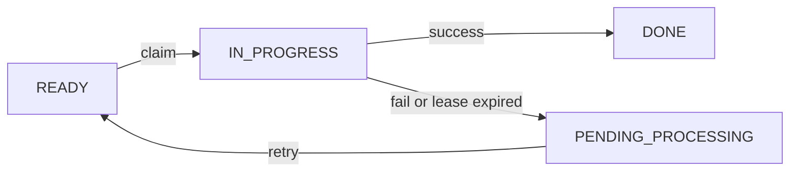

# Scaling Thoughtfully: Lessons from a Distributed Processing Exercise

*From simple coding exercises to production-ready distributed systems*

---

## Table of Contents
- [Scaling Thoughtfully: Lessons from a Distributed Processing Exercise](#scaling-thoughtfully-lessons-from-a-distributed-processing-exercise)
  - [Table of Contents](#table-of-contents)
  - [The Problem Setup](#the-problem-setup)
  - [Why Distributed Work is Tricky](#why-distributed-work-is-tricky)
    - [⚠️ Edge Cases to Watch For](#️-edge-cases-to-watch-for)
  - [Solution Design: The State Machine](#solution-design-the-state-machine)
    - [1. Claiming Work Safely (Avoiding Duplicate Work)](#1-claiming-work-safely-avoiding-duplicate-work)
    - [2. Handling Failures with Leases](#2-handling-failures-with-leases)
    - [3. Avoiding Worker Starvation](#3-avoiding-worker-starvation)
    - [4. Visibility and Observability](#4-visibility-and-observability)
  - [Understanding Database Locking](#understanding-database-locking)
  - [Future Enhancements](#future-enhancements)
    - [1. Message Queues (Pub/Sub)](#1-message-queues-pubsub)
    - [2. Back-Pressure and Rate Limiting](#2-back-pressure-and-rate-limiting)
    - [3. Dead Letter Queues](#3-dead-letter-queues)
    - [4. Circuit Breakers](#4-circuit-breakers)
  - [Implementation Snapshot (Async, Batched, Safe)](#implementation-snapshot-async-batched-safe)
  - [Architectural Observations](#architectural-observations)
  - [References](#references)
  - [Final Thoughts: Building Distributed Thinking](#final-thoughts-building-distributed-thinking)

---

> "Learning of the future is distributed, and the universities are in our sharings."

Recently, I gave myself a challenge that turned out to be a crash course in distributed systems, fault-tolerant processing, and good architecture. It began as a simple coding exercise to process a list of `InsuranceVerification` objects, but soon unfolded into a deep exploration of how distributed systems behave at scale.

This post is not about the interview where this problem was posed. Instead, it's about the **thinking that went into uncovering the edge cases** — and how I believe exercises like this are the future of real engineering learning.

---

## The Problem Setup

Here's a simplified version of the original exercise:

```python
from enum import StrEnum

class VerificationStatus(StrEnum):
    READY = "READY"
    IN_PROGRESS = "IN_PROGRESS"
    PENDING_PROCESSING = "PENDING_PROCESSING"
    DONE = "DONE"

class InsuranceVerification:
    id: str
    status: VerificationStatus

    def process(self):
        # Does expensive work here
        self.status = VerificationStatus.DONE

    def write_to_database(self):
        pass

    @staticmethod
    def get_by_status(status: VerificationStatus):
        return []  # Returns list of InsuranceVerification

    @staticmethod
    def get_by_id(id: str):
        return InsuranceVerification()
```

The task: **write a function to process all `InsuranceVerification` objects** across a distributed system.

Sounds simple, right?

---

## Why Distributed Work is Tricky

Once you move beyond a single thread, the complexity rises fast. Here's a taste of what you have to deal with:

### ⚠️ Edge Cases to Watch For

| Problem            | What Can Go Wrong                                  |
| ------------------ | -------------------------------------------------- |
| **Duplicate Work** | Two workers process the same record                |
| **Starvation**     | One worker hogs all records, others idle           |
| **Stuck Workers**  | A crash leaves rows in `IN_PROGRESS` forever       |
| **Overload**       | One worker tries to process everything and crashes |

To solve these, you need a blend of **atomicity**, **lease-based coordination**, **batching**, and **observability**.

---

## Solution Design: The State Machine

We can model this system with a simple state transition diagram:



And now, let's zoom in on each transition and the guardrails we need.

### 1. Claiming Work Safely (Avoiding Duplicate Work)

To prevent two workers from picking the same task, we use an **atomic update** in the database:

```sql
UPDATE insurance_verification
   SET status = 'IN_PROGRESS', lease_expires = NOW() + INTERVAL '5 minutes'
 WHERE status = 'READY'
 LIMIT 100
 RETURNING id;
```

This ensures that only one worker at a time can claim a given job.

> Note: This works best with databases that support `FOR UPDATE SKIP LOCKED` (e.g. Postgres).

### 2. Handling Failures with Leases

What if the worker crashes after claiming work?

Add a `lease_expires` field. If the lease has expired, another worker can pick up the work:

```sql
UPDATE insurance_verification
   SET status = 'READY'
 WHERE status = 'IN_PROGRESS'
   AND lease_expires < NOW();
```

This gives us resilience against crash-faults.

### 3. Avoiding Worker Starvation

To ensure fairness and throughput:

* Workers should claim **small batches** (e.g., 100 rows)
* Use **bounded concurrency** (e.g., max 50 concurrent async tasks)

```python
sem = asyncio.Semaphore(50)

async def process_one(verification_id):
    async with sem:
        ...  # process
```

### 4. Visibility and Observability

Mark failures with a reason:

```python
try:
    iv.process()
    iv.status = DONE
except Exception as exc:
    iv.status = PENDING_PROCESSING
    iv.last_error = str(exc)
```

Failures go to a triage state. That's your built-in dashboard for follow-up.

---

## Understanding Database Locking

**What is `FOR UPDATE SKIP LOCKED`?**

Unlike Python's Global Interpreter Lock (GIL), databases don't have a single lock that prevents concurrent access. Instead, you have to model coordination using database fields and locking mechanisms.

PostgreSQL's `FOR UPDATE SKIP LOCKED` is a powerful feature that:

1. **`FOR UPDATE`** - Locks the selected rows so other transactions can't modify them
2. **`SKIP LOCKED`** - If a row is already locked by another transaction, skip it instead of waiting

```sql
-- Without SKIP LOCKED: workers wait for each other
SELECT * FROM insurance_verification 
WHERE status = 'READY' 
FOR UPDATE;  -- Blocks until lock is available

-- With SKIP LOCKED: workers skip locked rows
SELECT * FROM insurance_verification 
WHERE status = 'READY' 
FOR UPDATE SKIP LOCKED;  -- Returns only unlocked rows
```

This means multiple workers can run simultaneously without blocking each other. Each worker gets a different subset of available work, eliminating the race condition that could cause duplicate processing.

**Why not just use a simple UPDATE?**
Without proper locking, two workers might both read the same "READY" row, then both try to update it. The database-as-queue pattern requires this atomic claim operation to be truly safe.

---

## Future Enhancements

The database-as-queue approach we've built is solid for moderate loads, but production systems often need more sophisticated patterns:

### 1. Message Queues (Pub/Sub)

For high-throughput scenarios, consider pushing work to a message broker:

```python
# Instead of polling the database
async def enqueue_work(verification_id: str):
    await kafka_client.send('insurance-verifications', {
        'id': verification_id,
        'timestamp': datetime.utcnow().isoformat()
    })

# Workers consume from queue
async def process_from_queue():
    async for message in kafka_consumer:
        verification_id = message['id']
        await process_verification(verification_id)
```

**Benefits:**
- **Decoupling**: Producers and consumers are independent
- **Back-pressure**: Queue size naturally limits processing rate
- **Durability**: Messages persist even if workers crash
- **Scalability**: Can handle millions of messages per second

### 2. Back-Pressure and Rate Limiting

Add intelligent polling to avoid overwhelming the system:

```python
async def process_all():
    sem = asyncio.Semaphore(50)
    while True:
        batch = await claim_ready_batch()
        if not batch:
            # No work found - wait before polling again
            await asyncio.sleep(0.5)  # Prevents tight polling
            continue
        
        await asyncio.gather(*(process_one(id, sem) for id in batch))
```

### 3. Dead Letter Queues

For failed jobs that need manual intervention:

```python
async def process_with_dlq(verification_id: str):
    try:
        await process_verification(verification_id)
    except Exception as exc:
        if retry_count >= max_retries:
            await dead_letter_queue.send({
                'id': verification_id,
                'error': str(exc),
                'failed_at': datetime.utcnow()
            })
        else:
            # Retry with exponential backoff
            await retry_queue.send(verification_id, delay=2**retry_count)
```

### 4. Circuit Breakers

Protect against cascading failures:

```python
from circuitbreaker import circuit

@circuit(failure_threshold=5, recovery_timeout=30)
async def call_external_api(verification_id: str):
    # External API calls that might fail
    pass
```

These enhancements transform a simple database queue into a production-ready distributed processing system.

---

## Implementation Snapshot (Async, Batched, Safe)

```python
async def claim_ready_batch():
    # Uses UPDATE ... RETURNING to atomically claim work
    return [row.id for row in ...]  # Get 100 ready rows

async def process_one(id, sem):
    async with sem:
        iv = InsuranceVerification.get_by_id(id)
        try:
            iv.process()
            iv.status = VerificationStatus.DONE
        except:
            iv.status = VerificationStatus.PENDING_PROCESSING
        iv.write_to_database()

async def process_all():
    sem = asyncio.Semaphore(50)
    while True:
        batch = await claim_ready_batch()
        if not batch:
            break
        await asyncio.gather(*(process_one(id, sem) for id in batch))
```

---

## Architectural Observations

One lesson I took away: **good naming reveals good design**.

In the original stub, `InsuranceVerification` was responsible for managing and processing *itself*. That violates the [Single Responsibility Principle](https://en.wikipedia.org/wiki/Single-responsibility_principle).

A better design would split the responsibilities:

* `InsuranceVerification`: the data model
* `InsuranceVerificationManager`: handles lifecycle and processing

This would make the code easier to reason about, test, and scale.

---

## References

* [PostgreSQL: SKIP LOCKED](https://www.postgresql.org/docs/current/sql-select.html#SQL-FOR-UPDATE-SHARE)
* [Redis Redlock Algorithm](https://redis.io/docs/latest/develop/data-types/distributed-locking/)
* [Martin Kleppmann on Idempotency](https://martin.kleppmann.com/2015/03/06/idempotence.html)
* [Designing a Work Queue](https://docs.aws.amazon.com/AWSSimpleQueueService/latest/SQSDeveloperGuide/standard-queues.html)

---

## Final Thoughts: Building Distributed Thinking

This exercise reminded me that scaling systems isn't just about performance — it's about correctness, coordination, and clarity.

And here's the thing: **you can practice this on your own.** Set up a little database, write a job queue, scale it across async workers. The complexity will reveal itself — and so will the learning.

If you're building or working with 0-to-1 products and want to prepare for scale, **start exploring distributed concerns early**. You don't need a 100-node cluster to learn it.

Stay curious, and keep building.

---

*If you found this helpful, I'd love to hear what problems you've hit in your own distributed systems.*
