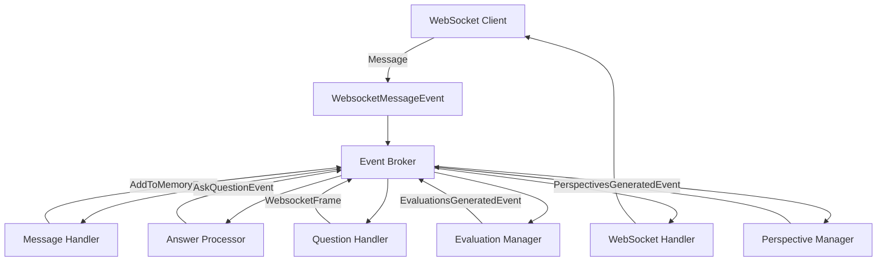

*Published on July 24, 2025*

When building AI-powered interview systems, managing complex interactions between components like question generation, answer processing, real-time evaluations, and WebSocket communications quickly becomes challenging. This post explains how we implemented an event-driven architecture that provides loose coupling, scalability, and maintainability for our AI interview agents.


## Table of Contents
- [Table of Contents](#table-of-contents)
- [Architecture Overview](#architecture-overview)
- [Core Components](#core-components)
  - [Event Broker](#event-broker)
  - [Typed Events](#typed-events)
  - [Command Pattern Integration](#command-pattern-integration)
- [Event Flow](#event-flow)
  - [Agent Context](#agent-context)
  - [Standardized Event Handlers](#standardized-event-handlers)
- [Implementation Details](#implementation-details)
  - [Handler Registration](#handler-registration)
  - [AI Integration](#ai-integration)
  - [Error Handling](#error-handling)
- [Conclusion](#conclusion)

## Architecture Overview

Our event-driven architecture centers around three key concepts: a central event broker, typed events, and specialized handlers. This design allows different parts of the interview system to communicate without tight coupling.



## Core Components

### Event Broker

The heart of our system is an async event broker implementing the publish-subscribe pattern:

```python
class Broker:
    def __init__(self) -> None:
        self._subscribers: dict[
            str, list[Callable[..., Awaitable[None]]]
        ] = defaultdict(list)
        self._event_queue: asyncio.Queue[
            BaseEvent | WebsocketFrame | CommandBase
        ] = asyncio.Queue()
        self._is_running: bool = False

    async def subscribe(
        self,
        event_type: Type[Event] | Type[CommandBase],
        handler: Callable[..., Awaitable[None]],
    ) -> None:
        """Subscribe to an event type with a handler function."""
        self._subscribers[event_type.__name__].append(handler)

    async def publish(
        self, event: BaseEvent | WebsocketFrame | CommandBase
    ) -> None:
        """Publish an event to the message queue."""
        await self._event_queue.put(event)

    async def _process_events(self) -> None:
        """Process events from the message queue."""
        while self._is_running:
            event = await self._event_queue.get()
            event_type = event.__class__.__name__

            handlers = self._subscribers.get(event_type, [])
            handlers.extend(self._subscribers.get("*", []))

            for handler in handlers:
                await handler(event)
```

### Typed Events

We use Pydantic models to define strongly-typed events with built-in validation:

```python
class BaseEvent(BaseModel):
    event_id: UUID = Field(default_factory=uuid4)
    timestamp: int = Field(
        default_factory=lambda: int(datetime.now().timestamp())
    )
    correlation_id: UUID = Field(default_factory=uuid4)

class MessageReceivedEvent(BaseEvent):
    message: str
    interview_id: UUID

class AskQuestionEvent(BaseEvent):
    question: QuestionAndAnswer
    interview_id: UUID

class EvaluationsGeneratedEvent(BaseEvent):
    evaluations: list[WebsocketFrame]
    interview_id: UUID
```

### Command Pattern Integration

For operations that need to trigger complex workflows, we use the command pattern:

```python
class CommandBase(BaseModel):
    pass

class GenerateEvaluationsCommand(CommandBase):
    questions: List[QuestionAndAnswer]

class GeneratePerspectivesCommand(CommandBase):
    questions: List[QuestionAndAnswer]
```

## Event Flow

The system processes events through well-defined stages:

| Stage | Component | Event Type | Purpose |
|-------|-----------|------------|---------|
| 1. Input | WebSocket Handler | `WebsocketFrame` | Receive client messages |
| 2. Parse | Message Handler | `MessageReceivedEvent` | Parse and validate input |
| 3. Store | Answer Processor | `AddToMemoryEvent` | Persist to memory store |
| 4. Generate | Question Manager | `AskQuestionEvent` | Create follow-up questions |
| 5. Evaluate | Evaluation Manager | `EvaluationsGeneratedEvent` | Generate assessments |
| 6. Output | WebSocket Handler | `WebsocketFrame` | Send responses to client |

### Agent Context

The `InterviewContext` ties everything together, providing shared state across all components:

```python
@dataclass(frozen=True)
class InterviewContext:
    interview_id: UUID
    agent_id: UUID
    interviewer: Interviewer
    memory_store: MemoryStore
    broker: Broker
    thinker: Thinker  # LLM integration
    channel: Channel  # WebSocket communication
    agent_profile: AgentProfile
    conversation_tree: Tree
    interview_abilities: InterviewAbilities
    max_time_allowed: int
```

### Standardized Event Handlers

Each event handler follows a consistent pattern for maintainability:

```python
class MessageEventHandler:
    def __init__(self, interview_context: InterviewContext) -> None:
        self.interview_context = interview_context

    async def handler(self, event: MessageReceivedEvent) -> None:
        try:
            message = event.message
            parsed_message = WebsocketFrame.model_validate_json(
                message, strict=False
            )
            
            new_memory = AddToMemoryEvent(
                frame=parsed_message,
                interview_id=self.interview_context.interview_id,
            )
            await self.interview_context.broker.publish(new_memory)
            
        except Exception as e:
            logger.error(f"Error in MessageEventHandler: {str(e)}")
            raise
```

## Implementation Details

### Handler Registration

The `InterviewManager` sets up all event subscriptions during initialization:

```python
async def setup_subscribers(self) -> None:
    await self.broker.subscribe(
        MessageReceivedEvent,
        MessageEventHandler(interview_context=self.interview_context).handler,
    )
    
    await self.broker.subscribe(
        AskQuestionEvent,
        AskQuestionEventHandler(interview_context=self.interview_context).handler,
    )
    
    await self.broker.subscribe(
        EvaluationsGeneratedEvent,
        EvaluationsGeneratedEventHandler(interview_context=self.interview_context).handler,
    )
```

### AI Integration

The `Thinker` component provides LLM capabilities with role-based context injection:

```python
class Thinker:
    async def extract_structured_response(
        self,
        pydantic_structure_to_extract: Type[T],
        messages: list[dict[str, str]],
        use_role_context: bool = False,
    ) -> T:
        if use_role_context:
            messages = self._boost_message_context_with_role(messages)

        instructor_client = instructor.from_openai(self.client)
        return await instructor_client.chat.completions.create(
            model=model,
            response_model=pydantic_structure_to_extract,
            messages=messages,
        )
```

### Error Handling

The system includes comprehensive error handling with automatic error event propagation:

```python
async def handler(self, event: WebsocketFrame) -> None:
    try:
        await self.interview_context.channel.send_message(
            event.model_dump_json(by_alias=True)
        )
    except Exception as e:
        error_event = ErrorEvent(
            error=str(e),
            interview_id=self.interview_context.interview_id,
        )
        await self.interview_context.broker.publish(error_event)
        raise
```

## Conclusion

This event-driven architecture provides several key benefits for our AI interview system:

- **Loose Coupling**: Components communicate only through events, making the system more maintainable
- **Scalability**: New features can be added by creating new event types and handlers
- **Testability**: Each handler can be tested in isolation
- **Real-time Processing**: Async event processing enables responsive user interactions
- **Error Resilience**: Centralized error handling and event propagation

The modular design evolved from monolithic handlers to dedicated event handler modules, demonstrating how event-driven patterns naturally support system growth and refactoring. By leveraging Python's async capabilities and Pydantic's type safety, we created a robust foundation for complex AI agent interactions.

****
