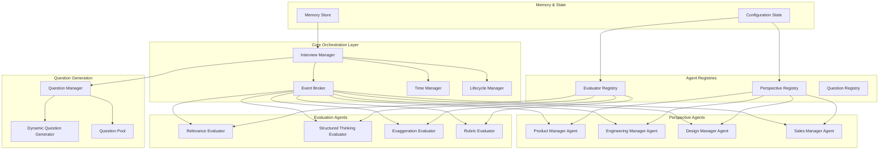
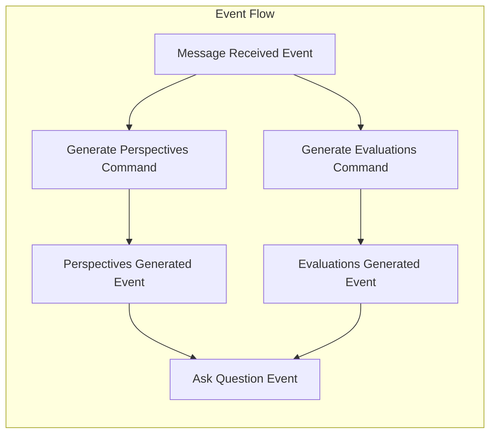
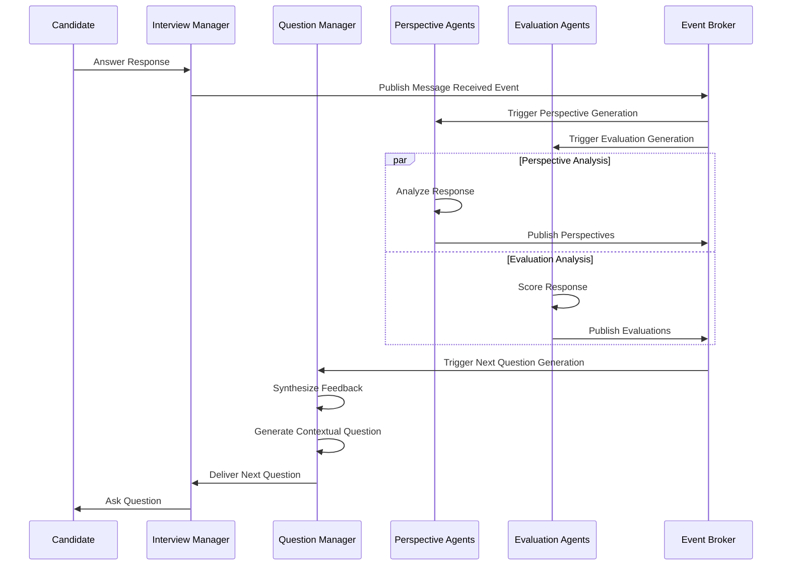
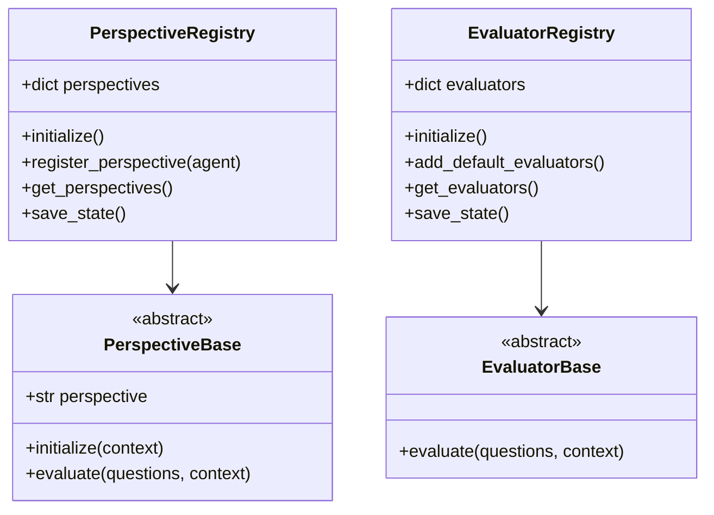
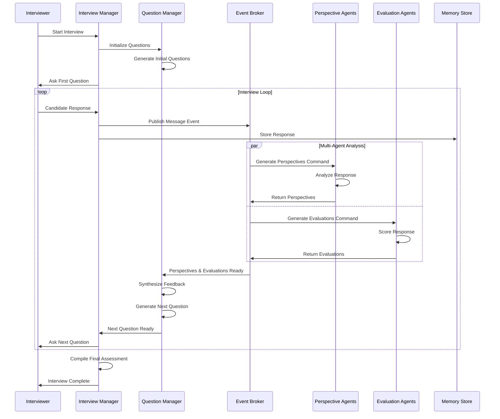

# Building Multi-Agentic Interview Systems: Trading Latency for Depth

In the rapidly evolving landscape of AI-powered hiring tools, we've embarked on an ambitious journey to create something fundamentally different: a multi-agentic interview system that mimics the complexity and depth of real-world panel interviews. Rather than optimizing for speed, our system makes a deliberate trade-off—sacrificing latency for unprecedented interview depth and comprehensive evaluation.

## The Architecture: A Symphony of Specialized Agents

Our multi-agentic interview system is built around a central **Interview Manager** that orchestrates a collection of specialized micro-agents, each bringing unique perspectives and evaluation criteria to the interview process. This architecture reflects a key insight: great hiring decisions aren't made by a single mind, but through the collective wisdom of diverse viewpoints.

### System Overview

### The Central Nervous System: Event-Driven Architecture

At the heart of our system lies an event-driven architecture powered by a custom **Event Broker**. This broker acts as the central nervous system, enabling asynchronous communication between all agents while maintaining loose coupling and high scalability.

## The Agent Ecosystem: Specialized Intelligence

### Perspective Agents: The Panel Members

Each perspective agent represents a different hiring stakeholder, bringing domain-specific insights to the evaluation process:

- **Product Manager Agent**: Focuses on product thinking, user empathy, and strategic vision
- **Engineering Manager Agent**: Evaluates technical depth, system design, and engineering practices
- **Design Manager Agent**: Assesses user experience thinking, design principles, and creative problem-solving
- **Sales Manager Agent**: Examines communication skills, persuasion abilities, and customer-facing competencies

These agents operate independently, analyzing the same candidate responses through their unique lenses. Each perspective agent maintains its own evaluation criteria and weighting system, just as human panel members would bring their individual biases and priorities.

### Evaluation Agents: The Assessment Specialists

Our evaluation layer consists of multiple specialized agents, each focusing on specific assessment dimensions:

- **Relevance Evaluator**: Measures how well responses address the actual question asked
- **Structured Thinking Evaluator**: Assesses the logical flow and organization of candidate responses
- **Exaggeration Evaluator**: Identifies potential overselling or inaccurate claims
- **Rubric Evaluator**: Applies role-specific scoring criteria dynamically generated for each position

### The Question Intelligence System

The question management system represents perhaps our most sophisticated component. Rather than following a predetermined script, our **Dynamic Question Generator** adapts in real-time based on:

- Previous candidate responses
- Perspective agent feedback
- Evaluation outcomes
- Interview progression and time constraints

## The Registry Pattern: Scalable Agent Management

Our system employs a registry pattern for managing different types of agents. This pattern provides several key benefits:

1. **Dynamic Agent Loading**: Agents can be registered and deregistered at runtime
2. **Configuration-Driven Setup**: Agent behaviors can be modified through configuration files
3. **Easy Extensibility**: New perspective or evaluation agents can be added without core system changes
4. **State Persistence**: Agent configurations and learned behaviors are preserved across sessions

## The Benefits: Why Complexity Pays Off

### 1. Comprehensive Evaluation Coverage

Traditional single-agent interview systems suffer from inherent blind spots. Our multi-agentic approach ensures that candidates are evaluated from multiple professional perspectives simultaneously, reducing the risk of missing critical competencies or overweighting certain skills.

### 2. Dynamic Adaptability

The system learns and adapts throughout the interview. If perspective agents identify areas requiring deeper exploration, the question generation system automatically adjusts to probe those areas more thoroughly. This creates a more natural, investigative interview flow.

### 3. Bias Mitigation Through Diversity

By incorporating multiple perspective agents with different evaluation priorities, the system naturally balances potential biases. A candidate who might score poorly with one perspective agent could excel with another, providing a more holistic assessment.

### 4. Scalable Expertise

Adding new evaluation criteria or hiring perspectives is as simple as registering new agents. The system can accommodate specialized roles, industry-specific requirements, or organizational culture assessments without architectural changes.

### 5. Rich, Contextual Feedback

Each agent contributes detailed feedback and scoring, creating a comprehensive evaluation report that goes far beyond simple numerical scores. Hiring managers receive nuanced insights about candidate strengths and areas of concern.

## The Trade-offs: Acknowledging the Costs

### 1. Increased Latency

Our most significant trade-off is response time. While a simple AI interviewer might respond within seconds, our system requires additional time for:
- Multiple agent evaluations to complete
- Perspective synthesis and analysis
- Dynamic question generation based on multi-agent feedback
- Memory store updates and state persistence

This can result in 10-30 second delays between candidate responses and follow-up questions.

### 2. Computational Complexity

Running multiple AI agents simultaneously requires significantly more computational resources than single-agent systems. Each perspective and evaluation agent may make independent LLM calls, multiplying the inference costs and memory requirements.

### 3. System Complexity and Maintenance

The multi-agentic architecture introduces numerous components that must be monitored, debugged, and maintained. Event-driven systems can be particularly challenging to troubleshoot when issues arise across multiple asynchronous agents.

### 4. Configuration Management Overhead

Each agent requires careful configuration and tuning. The system's flexibility comes at the cost of complexity in setup and optimization. Poor agent configuration can lead to inconsistent or contradictory evaluations.

### 5. Potential for Agent Conflicts

Different perspective agents may reach conflicting conclusions about candidate suitability. While this diversity can be valuable, it also requires sophisticated reconciliation mechanisms to produce actionable hiring recommendations.

## The Interview Flow: Orchestrated Intelligence

## Looking Forward: The Future of Agentic Interviews

Our multi-agentic interview system represents a fundamental shift in how we think about AI-powered hiring. By embracing complexity and trading latency for depth, we've created a system that more closely mirrors the nuanced, multi-faceted nature of human decision-making in hiring.

The development journey, reflected in our git history, shows a clear evolution from simple question-answer systems to sophisticated, event-driven architectures capable of real-time evaluation and dynamic adaptation. Key milestones include:

- **Enhanced Interview Flow**: Introduction of dynamic question generation and turn management
- **Advanced Evaluation System**: Implementation of real-time scoring and candidate ranking
- **Multi-Agent Architecture**: Evolution from single-agent to comprehensive multi-perspective evaluation

As we continue to refine this system, we're exploring several exciting directions:

1. **Learning Agent Networks**: Agents that improve their evaluation accuracy based on hiring outcomes
2. **Cross-Interview Intelligence**: Perspective agents that learn from patterns across multiple interviews
3. **Cultural Fit Assessment**: Specialized agents that evaluate alignment with organizational values and culture
4. **Industry-Specific Expertise**: Domain-specific agent networks for specialized roles and industries

The future of hiring lies not in faster AI, but in deeper, more thoughtful AI. Our multi-agentic approach proves that sometimes, the best solution isn't the quickest one—it's the most comprehensive.

## Conclusion

Building a multi-agentic interview system requires careful consideration of trade-offs between speed and depth. While our approach sacrifices the immediate responsiveness that users might expect from AI systems, it delivers something far more valuable: the kind of thorough, multi-perspective evaluation that leads to better hiring decisions.

The complexity is intentional, the latency is purposeful, and the results speak for themselves. In a world where hiring mistakes are costly and talent is precious, we believe the extra seconds spent in thoughtful analysis are an investment worth making.

As we've learned through this development journey, the most sophisticated problems require sophisticated solutions. Our multi-agentic interview system doesn't just automate the hiring process—it enhances it, bringing the collective wisdom of diverse professional perspectives to every conversation.
