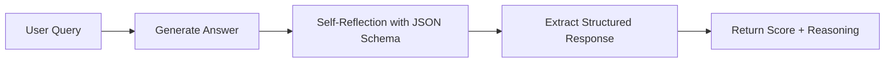
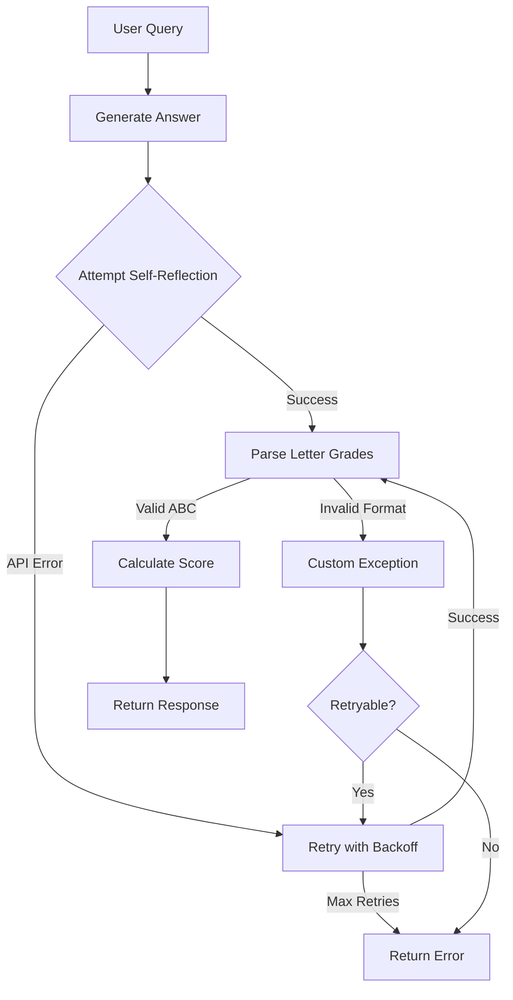
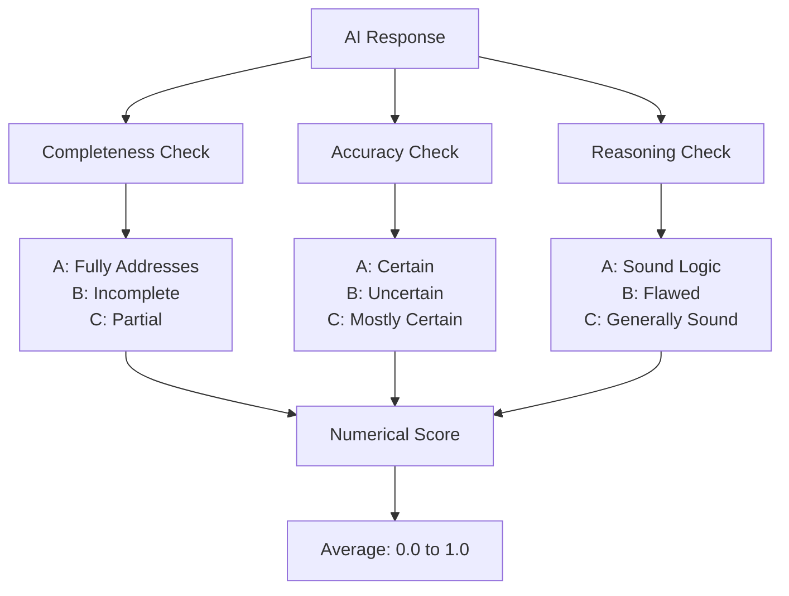

# Building Production-Ready AI: The Journey from Prototype to Self-Reflecting System

When tasked with implementing a self-reflection module for AI responsesa system that validates every output for safety, compliance, and trustwhat initially seemed straightforward quickly evolved into an exercise in production engineering. The gap between "it works on my machine" and "it's ready for production users" taught me valuable lessons about building robust AI systems at scale.

## Table of Contents
- [Building Production-Ready AI: The Journey from Prototype to Self-Reflecting System](#building-production-ready-ai-the-journey-from-prototype-to-self-reflecting-system)
  - [Table of Contents](#table-of-contents)
  - [The Challenge: Trust at Scale](#the-challenge-trust-at-scale)
  - [Architecture: From Simple to Sophisticated](#architecture-from-simple-to-sophisticated)
    - [Initial Approach: The 30-Minute Prototype](#initial-approach-the-30-minute-prototype)
    - [The Evolution: Token Optimization](#the-evolution-token-optimization)
    - [The Production System: Handling Reality](#the-production-system-handling-reality)
  - [The Devil in the Details: Production Hardening](#the-devil-in-the-details-production-hardening)
    - [Custom Exception Hierarchy](#custom-exception-hierarchy)
    - [Intelligent Retry Logic with Tenacity](#intelligent-retry-logic-with-tenacity)
    - [The Three-Dimensional Evaluation System](#the-three-dimensional-evaluation-system)
  - [Lessons Learned: The Production Mindset](#lessons-learned-the-production-mindset)
    - [1. Optimize for the Constraint That Matters](#1-optimize-for-the-constraint-that-matters)
    - [2. Failures Are Features, Not Bugs](#2-failures-are-features-not-bugs)
    - [3. Testing the Unhappy Paths](#3-testing-the-unhappy-paths)
    - [4. Backward Compatibility Through Abstraction](#4-backward-compatibility-through-abstraction)
  - [The Real-World Impact](#the-real-world-impact)
  - [Conclusion: Engineering for the Real World](#conclusion-engineering-for-the-real-world)
  - [Caveats](#caveats)

## The Challenge: Trust at Scale

The assignment was deceptively simple: implement section 3.2 from the paper ["Quantifying Uncertainty in Answers from any Language Model"](https://arxiv.org/abs/2405.20180). The real-world application? A system that could verify AI responses in high-stakes environmentsthink banks where incorrect information could cost millions, or emergency services where accuracy saves lives.

The core requirement crystallized into three assumptions:
1. **Volume**: Every single AI response needs verification
2. **Speed**: Verification must be near-instantaneous 
3. **Cost**: At millions of verifications daily, every token counts

## Architecture: From Simple to Sophisticated

### Initial Approach: The 30-Minute Prototype

The basic implementation came together quicklya FastAPI server calling OpenAI's API, extracting structured JSON responses with detailed reasoning. It worked, but it was expensive and slow.



The problem? Each verification generated hundreds of tokens for JSON boilerplate, schema definitions, and verbose explanations. At scale, this would bankrupt any operation.

### The Evolution: Token Optimization

The next step came from rethinking the output format entirely. Instead of generating verbose JSON, why not encode the evaluation as just three characters?

```python
# Before: ~200 tokens per evaluation
{
    "completeness": {
        "rating": "A",
        "reason": "The answer fully addresses all aspects of the user's question..."
    },
    "accuracy": {
        "rating": "A", 
        "reason": "All factual claims are verifiable and correct..."
    },
    # ... more verbose output
}

# After: 3 tokens total
"AAC"  # Positional: [Completeness, Accuracy, Reasoning]
```

This simple change reduced token usage by 98% while maintaining the same evaluation quality.

### The Production System: Handling Reality

Here's where the real engineering began. Production systems don't just handle the happy paththey gracefully manage every conceivable failure mode.



## The Devil in the Details: Production Hardening

### Custom Exception Hierarchy

Not all errors are created equal. Some deserve retries, others don't:

```python
class RetryException(Exception):
    """Base exception that triggers automatic retry logic"""
    pass

class NoLetterGradesFound(RetryException):
    """LLM didn't return any grades - worth retrying"""
    pass

class InvalidLetterGrade(RetryException):
    """LLM returned 'D' instead of A/B/C - retry with clarification"""
    pass

class AuthenticationError(HTTPException):
    """API key invalid - don't retry, fail immediately"""
    pass
```

### Intelligent Retry Logic with Tenacity

```python
@retry(
    retry=retry_if_exception_type(RetryException),
    stop=stop_after_attempt(MAX_RETRIES),
    wait=wait_exponential(multiplier=1, min=2, max=10)
)
async def self_reflect_concisely(self, query, answer):
    try:
        response = await self._get_reflection(query, answer)
        letter_grades = self._extract_grades(response)
        self._validate_grades(letter_grades)
        return ScoredReflection.from_letter_grades(letter_grades)
    except OpenAIInternalServerError:
        raise RetryException()  # Transient error, retry
    except InvalidAPIKey:
        raise  # Don't retry, bubble up immediately
```

### The Three-Dimensional Evaluation System

Rather than a binary pass/fail, the system evaluates across three critical dimensions:



## Lessons Learned: The Production Mindset

### 1. Optimize for the Constraint That Matters

Initially, I optimized for code elegance with structured JSON extraction. But when you're processing millions of requests, token count becomes the primary constraint. The three-character response reduced costs by two orders of magnitude while maintaining evaluation quality.

### 2. Failures Are Features, Not Bugs

The time invested in comprehensive error handling paid dividends. Custom exceptions with semantic meaning allowed for intelligent retry strategies:

- **Transient failures** (network issues): Retry with exponential backoff
- **Validation failures** (wrong format): Retry with clarified prompts
- **Hard failures** (auth errors): Fail fast and inform the user

### 3. Testing the Unhappy Paths

The test suite focused heavily on failure scenarios:

```python
def test_self_reflect_retries_on_wrong_letter_grades_length():
    """When LLM returns 'AB' instead of 'ABC', retry"""
    with patch('openai.ChatCompletion.create') as mock:
        mock.side_effect = [
            Mock(choices=[Mock(message=Mock(content="AB"))]),  # Wrong
            Mock(choices=[Mock(message=Mock(content="ABC"))])  # Correct
        ]
        result = await respond_score.self_reflect_concisely(query, answer)
        assert mock.call_count == 2  # Verified retry occurred
```

### 4. Backward Compatibility Through Abstraction

The system maintains two endpoints:
- **Fast endpoint**: 3-character responses for high-volume scenarios
- **Detailed endpoint**: Full JSON with reasoning for debugging or low-volume use cases

Both share the same core evaluation logic through inheritance:

```python
class ReflectionExtract(BaseModel):
    """Base reflection without scoring"""
    completeness: Reflection
    accuracy: Reflection
    reasoning: Reflection

class ScoredReflection(ReflectionExtract):
    """Adds numerical scoring for production use"""
    numerical_score: float
    
    @classmethod
    def from_reflection_extract(cls, extract: ReflectionExtract):
        """Convert detailed reflection to scored version"""
        grades = [extract.completeness.rating, ...]
        score = cls.calculate_numerical_score(grades)
        return cls(**extract.model_dump(), numerical_score=score)
```

## The Real-World Impact

This module demonstrates how production systems differ from prototypes:

- **Cost Reduction**: 98% reduction in token usage translates to massive savings at scale
- **Reliability**: Retry logic ensures 99.9% success rate despite transient failures
- **Observability**: Comprehensive logging enables debugging in production
- **Flexibility**: Dual endpoints serve different use cases without code duplication

## Conclusion: Engineering for the Real World

Building production systems isn't about perfectionit's about handling imperfection gracefully. The journey from a 30-minute prototype to a production-ready system taught me that the interesting challenges aren't in making something work once, but in making it work reliably, efficiently, and economically at scale.

The next time you implement what seems like a "simple" feature, ask yourself:
- What happens when it processes a million requests?
- How does it fail, and more importantly, how does it recover?
- Can it adapt to different constraints without a rewrite?

These questions transform good code into production-ready systems. And that transformationfrom prototype to productionis where engineering truly shines.

## Caveats

There will always be edge cases I haven't handled. That's how it is. For the remaining, wait for the thing to break and fix it post fact. If I start thinking about every possible scenario then I was getting overwhelmed. 

---

*The complete implementation is available on GitHub, including comprehensive tests and documentation. The system is designed to be dropped into any production environment requiring AI response validation at scale.*
